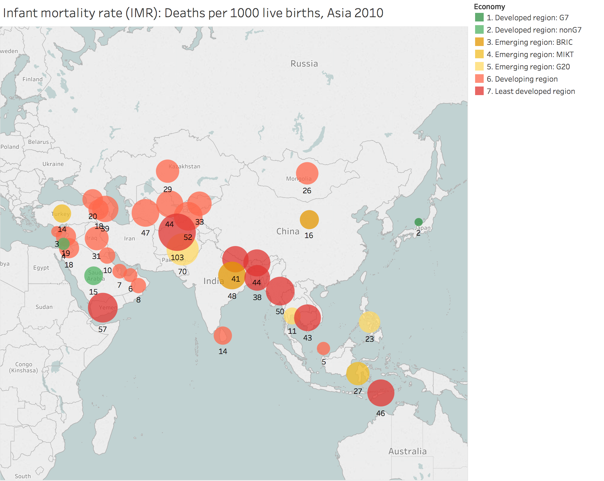
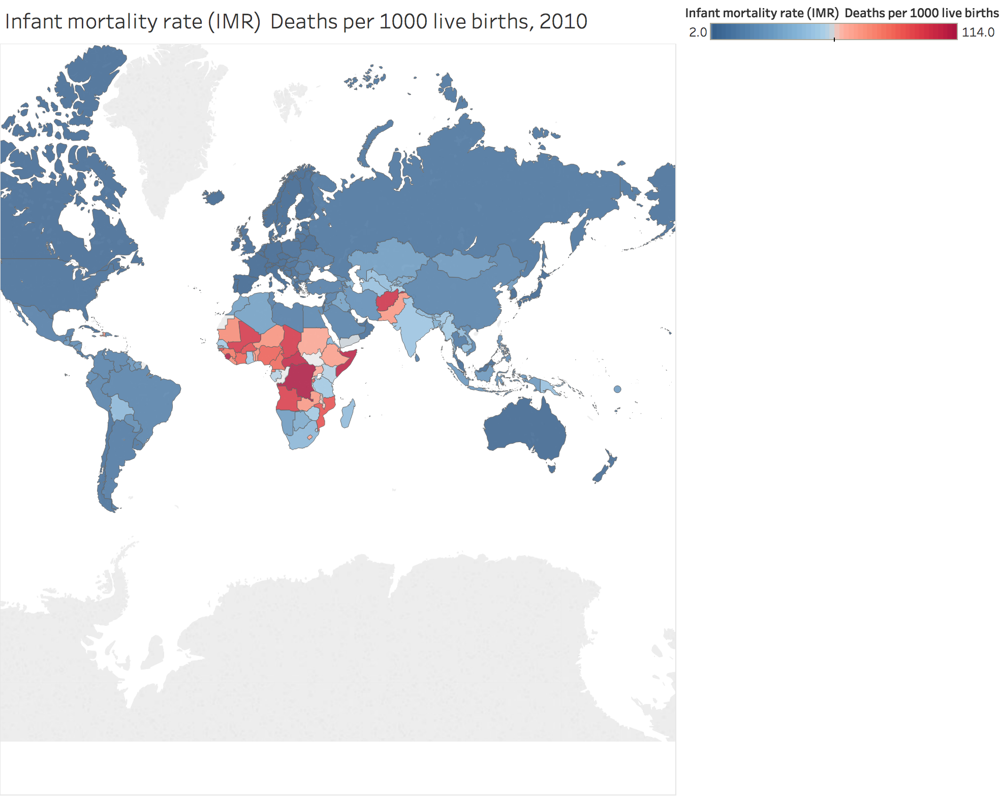
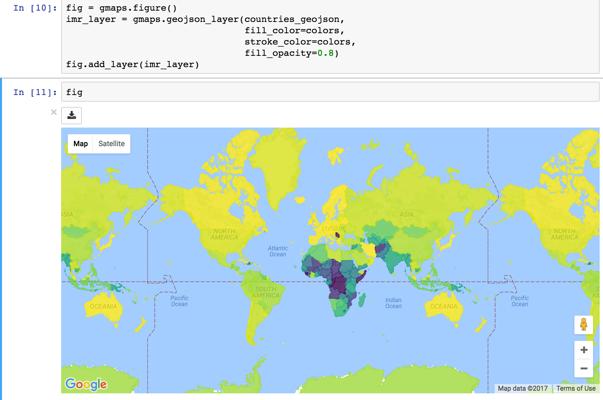

# IMR2010
Visualize Infant mortality rate (IMR) 2010

The infant mortality rate (IMR) data can be downlaoded from Devinfo, a database developed by UNICEF in cooperation with the UN System to assist the UN and Member States in tracking progress toward the Millennium Development Goals (MDGs). 'IMR.csv' in this repository contains the Infant mortality rate (IMR) -- Deaths per 1000 live births of the countrys in 2010.

## 1. Visualizing in Tableau

Tableau (https://www.tableau.com/) is a powerful tool for visualizing data. It has a mapping functionality which is very ease to use. To plot IMR on a map in Tableau, we also need the geographic data that connect the IMR data with the map and there are two ways for Tableau to read the spatial information.

### 1.1 Use the Spatial file

The Spatial file can be a shapefile, a MapInfo table or a GeoJSON. More information about the acceptable file types and connecting to Spacial files in Tableu can be found in http://onlinehelp.tableau.com/current/pro/desktop/en-us/maps_shapefiles.html. 

Use the geojson file from http://data.okfn.org/data/datasets/geo-boundaries-world-110m, and build the map for Asian IMR in two dimensions (IMR and economy): 

https://public.tableau.com/views/IMR2010_Asia/IMR_Asia_2010?:embed=y&:display_count=yes



### 1.2 Extract the Spacial information from GoogleMap

GoogleMap provides the geocoding API the latitude and logitude for each country can be extracted with Python in Jupyter Notebook.

Install and import googlemaps package for Python, authenticate with Google Maps using API key:
```
!pip install googlemaps
```

```
import googlemaps
gomaps = googlemaps.Client(key='AI...')
```
('AI...' is your Google Maps API key.)

Import pandas to read the IMR data:
```
import pandas as pd
import numpy as np 
IMR = pd.read_csv('IMR.csv',encoding = "ISO-8859-1")
```

Extract the latitude and longitude from googlemaps:
```
lat = []
lng = []
for i in range(len(IMR['Area'])):
    gm_re = gomaps.geocode(IMR['Area'][i])
    lat.append(gm_re[0]['geometry']['location']['lat'])
    lng.append(gm_re[0]['geometry']['location']['lng']) 
```

Write geoinfomation data to 'geoinf.csv' for Tableau drawing the maps:
```
country = list(IMR['Area'])
col=['Country','Latitude','Longitude']
geoinf = pd.DataFrame([country,lat,lng], col)
geoinf = geoinf.transpose()
geoinf.to_csv('geoinf.csv')
```

Then import 'IMR.csv' and 'geoinf.csv' to Tableau, connected two data file by country, plot the global IMR:

https://public.tableau.com/views/IMR_2010_globe/Dashboard1?:embed=y&:display_count=yes




## 2. Visualizing in Jupyter notebook with gmaps package

gmaps is a plugin for including interactive Google maps in the IPython Notebook. It contains the GeoJSON of countries.

First, install gmaps:
```
!pip install gmaps
```
Import gmaps and matplotlib for plotting, authenticate with Google Maps using API key, and load geojson:
```
from matplotlib.cm import viridis
from matplotlib.colors import to_hex

import gmaps
import gmaps.geojson_geometries

gmaps.configure(api_key="AI...")

#Load geojson
countries_geojson = gmaps.geojson_geometries.load_geometry('countries')
```

Mapping the IMR to colors:
```
imr_max = max(IMR['Data Value'])
imr_min = min(IMR['Data Value'])
imr_range = imr_max - imr_min

def calc_color(imr):
    norm_imr = (imr - imr_min) / imr_range
    inv_imr = 1.0 - norm_imr
    mpl_color = viridis(inv_imr)
    gmaps_color = to_hex(mpl_color, keep_alpha=False)
    return gmaps_color
```

Decides the color for each contry:
```
colors = []
for feature in countries_geojson['features']:
    country_name = feature['properties']['name']
    try:
        if(len(IMR.loc[IMR['Area'] == country_name]['Data Value'])):
            imr = int(IMR.loc[IMR['Area'] == country_name]['Data Value'])
            color = calc_color(imr)
    except KeyError:
        # no IMR for that country: return default color
        color = (0, 0, 0, 0.3)
    colors.append(color)
```

Finally, plotting the map:
```
fig = gmaps.figure()
imr_layer = gmaps.geojson_layer(countries_geojson, 
                                fill_color=colors, 
                                stroke_color=colors,
                                fill_opacity=0.8)
fig.add_layer(imr_layer)
fig
```

It will return a google map with detailed geographic information and interactice in the Jupyter notebook like this:




